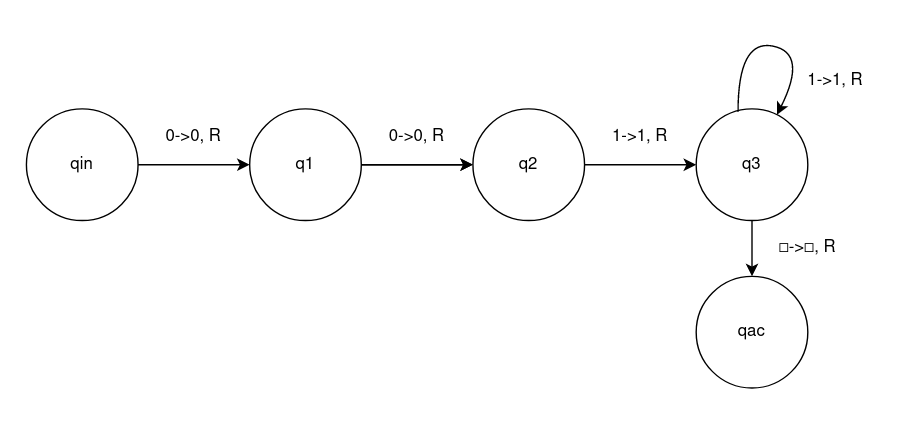

# Simple-Turing-Machine-Emulator
A simple turing machine emulator

This was made with the goal of practising C++ and for fun.

## To-do 
- [x] Text evaluator for ease of use
- [ ] Extensive testing
- [ ] Some documentation and comments

---
## Example
The following Turing Machine accepts all input that starts with two '0's and has more than one '1' after them.



Let's say we want to test the input 001111:

---
### Using the text evaluator
The configuration file will be [example.txt](example.txt), and it follows the syntax described in [BNF.md](BNF.md):
```
init(q0);
acc(qac);
rej(qrej);

rejectOthers();

q0 ->
    q1: 
        0->0, r;

q1 ->
    q2:
        0->0, r;

q2 ->
    q3:
        1->1, r;

q3 ->{
    q3:
        1->1, r;
    qac:
        ' '->' ', r;
}
```
The test is simply run with the following command (linux terminal):
>./tm example.txt 001111

---
### Using the Turing Machine library directly
```cpp
tmch::TuringMachine tm;
tm.setAccept("qac");
tm.setReject("qrej");
tm.setInitial("qi");
tm.setRejectNoConnection(true);
tm.addState("q1");
tm.addState("q2");
tm.addState("q3");

tm.getState("qi").addRule('0', 'x',tmch::RIGHT, "q1");

tm.getState("q1").addRule('0', 'x',tmch::RIGHT, "q2");

tm.getState("q2").addRule('1', '1',tmch::RIGHT, "q3");

tm.getState("q3").addRule('1', '1',tmch::RIGHT, "q3");

tm.getState("q3").addRule(' ', ' ',tmch::RIGHT, "qac");


tm.load("0111111");

while(tm.state != tmch::ACCEPT && tm.state != tmch::REJECT){
    tm.step();
}
std::cout << tm << std::endl;

return 0;
```

---
```cpp
tm.setAccept("qac");
tm.setReject("qrej");
tm.setInitial("qi");
```
The code above sets all the essencial states of a Turing Machine: the accept, reject and initial states
The argument is just the name which these states will be referenced by.
Only the initial state will be a "real" state, as in, can (and should) have connections to other states.

```cpp
setRejectNoConnection(true);
```
This line makes it so that every connection that is not defined, is treated as rejecting the input.

```cpp
tm.addState("q1");
```
This function just adds a possible state for the machine.
Once again, the argument is the name

```cpp
tm.getState("qi").addRule('0', 'x',tmch::RIGHT, "q1");
```
This line defines a connection that goes from the state "qi" to the state "q1", recognizing the character '0' and writing 'x' in it's spot. It also shifts the pointer of the machine (in the input line) to the right.

```cpp
tm.load("0111111");
```
This line loads the parameter as the input to the machine. This function also sets the current state to the previously defined initial state.

```cpp
while(tm.state != tmch::ACCEPT && tm.state != tmch::REJECT){
    tm.step();
}
```
Run the program until it is accepted or rejected

```cpp
std::cout << tm << std::endl;
```
Print the current configuration of the machine
